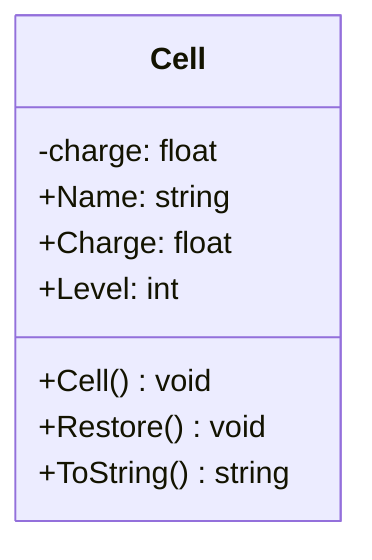

```mermaid
classDiagram 
    class Cell {
        -charge: float
        +Name: string
        +Charge: float
        +Level: int


        +Cell() void
        +Restore() void
        +ToString() string
        
    }
```